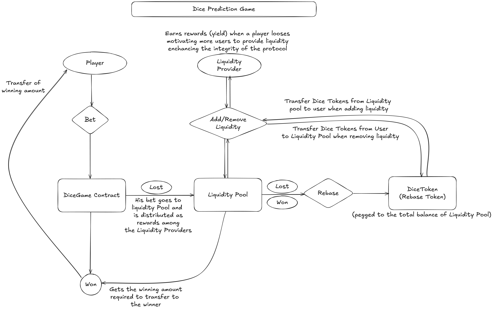

# Dice Prediction Game

It is a decentralized dice prediction game built with [Solidity](https://docs.soliditylang.org/en/latest/) using [Foundry](https://book.getfoundry.sh/) and a modern [Next.js](https://nextjs.org/) frontend.

-   It is a comprehensive blockchain-based dice game I developed leveraging Foundry and React.
-   It consists of multiple sub-components:
    -   **Smart Contract (DiceGame)**: Core game contract with prediction mechanics and reward distribution
    -   **Real-time Random Number Generation**: Integration with Chainlink VRF for provably fair dice rolls
    -   **Liquidity Pool System**: Decentralized liquidity management for game rewards
    -   **DiceToken**: ERC-20 rebase token for liquidity providers
-   The platform enables users to predict dice outcomes (1-6) and win rewards based on correct predictions with a 2x multiplier.
-   It implements advanced DeFi strategies including:
    -   Automated dice rolling and settlement using Chainlink VRF
    -   Liquidity provision and reward distribution mechanisms
    -   Provably fair gaming through blockchain transparency
-   Supports Ethereum Sepolia testnet with configurable network settings.

## Game Flow



## Play the Game

🎮 **Live Game**: [https://dice-prediction-game-eta.vercel.app/](https://dice-prediction-game-eta.vercel.app/)

⚠️ **Important**: To run the app properly, remember to switch off CORS restrictions in your browser. You can do so by using a simple browser extension like "CORS Unblock" or "Disable CORS".

## Key Features

### 1. Dice Prediction Game

-   **Fair Dice Rolling**: Predict dice outcomes (1-6) with provably fair results
-   **2x Multiplier**: Win double your bet amount on correct predictions
-   **Flexible Betting**: Customizable bet amounts with minimum bet requirements
-   **Real-time Results**: Instant game results powered by Chainlink VRF

### 2. Liquidity Management

-   **Liquidity Provision**: Users can add native tokens (ETH) to back game rewards
-   **DiceToken Rewards**: Liquidity providers receive rebase tokens representing their share
-   **Dynamic Management**: Add and remove liquidity as needed
-   **Profit Sharing**: Liquidity providers earn from game losses

### 3. Provably Fair Gaming

-   **Chainlink VRF**: Cryptographically secure random number generation
-   **Transparent Results**: All game outcomes verifiable on-chain
-   **No House Edge Manipulation**: Decentralized and transparent game mechanics

## Architecture

### Smart Contract (`src/`)

-   **DiceGame Contract**: Main game contract handling predictions, betting, and settlements
-   **LiquidityPool Contract**: Manages liquidity provision and withdrawal
-   **DiceToken Contract**: ERC-20 rebase token for liquidity providers
-   **Chainlink VRF Integration**: Secure random number generation for fair dice rolls

### Frontend (`frontend-dice-prediction-game/`)

-   **Next.js Application**: Modern React-based user interface
-   **Wallet Integration**: Privy for seamless wallet connections
-   **Real-time Updates**: Live game status and portfolio tracking
-   **Responsive Design**: Mobile-friendly gaming interface

## Getting Started

-   [git](https://git-scm.com/book/en/v2/Getting-Started-Installing-Git): You'll know you did it right if you can run `git --version` and you see a response like `git version x.x.x`
-   [foundry](https://getfoundry.sh/): You'll know you did it right if you can run `forge --version` and you see a response like `forge 0.2.0 (816e00b 2023-03-16T00:05:26.396218Z)`
-   [Node.js](https://nodejs.org/): You'll know you did it right if you can run `node --version` and you see a response like `v18.x.x`
-   [npm](https://www.npmjs.com/) or [yarn](https://yarnpkg.com/): You'll know you did it right if you can run `npm --version` or `yarn --version`

## Installation

-   Install Dice Prediction Game

```bash
    git clone https://github.com/yug49/Dice-Prediction-Game
    cd Dice-Prediction-Game
```

### Smart Contract Setup

-   Make a .env file

```bash
    touch .env
```

-   Open the .env file and fill in the details similar to:

```env
    SEPOLIA_RPC_URL=<YOUR SEPOLIA RPC URL>
    ETHERSCAN_API_KEY=<YOUR ETHERSCAN API KEY>
    PRIVATE_KEY=<YOUR PRIVATE KEY>
```

-   Install dependencies and libraries

```bash
    forge install
```

-   Build Smart Contract

```bash
    forge build
```

### Frontend Setup

-   Navigate to the frontend directory

```bash
    cd frontend-dice-prediction-game
```

-   Install frontend dependencies

```bash
    yarn install
    # or
    npm install
```

-   Create frontend environment file

```bash
    touch .env.local
```

-   Configure your .env.local file:

```env
    SEPOLIA_RPC_URL=<YOUR SEPOLIA RPC URL>
```


## Deployment

### Chainlink VRF Setup

-   Create a Chainlink VRF subscription at [vrf.chain.link](https://vrf.chain.link/)
-   Fund your subscription with LINK tokens
-   Replace the old subscription Id in `script/HelperConfig.s.sol` with your new subscription ID

### Smart Contract Deployment

For Sepolia testnet deployment:

```bash
    forge script script/DeployGame.s.sol:DeployGame --rpc-url $SEPOLIA_RPC_URL --private-key $PRIVATE_KEY --etherscan-api-key $ETHERSCAN_API_KEY --broadcast --verify --legacy -vvv
```

-   After deployment configure the contract addresses in fontend-dice-prediction-game/src/contants.ts by replacing the old contract addresses with the new ones.


### Frontend Deployment

-   Build the frontend application:

```bash
    cd frontend-dice-prediction-game
    yarn build
    # or
    npm run build
```

-   Start the development server:

```bash
    yarn dev
    # or
    npm run dev
```

-   Access the application at `http://localhost:3000`

## Usage

### Playing the Game

1. **Connect Wallet**: Use Privy to connect your wallet to the app
2. **Place Bet**: Choose your bet amount (minimum bet applies)
3. **Predict**: Select your predicted dice outcome (1-6)
4. **Roll Dice**: Submit transaction to roll the dice
5. **Win/Lose**: Get 2x your bet if prediction is correct, lose bet if wrong

### Providing Liquidity

1. **Add Liquidity**: Deposit ETH to the liquidity pool
2. **Receive DiceTokens**: Get rebase tokens representing your liquidity share
3. **Earn Rewards**: Benefit from players' losses
4. **Withdraw**: Remove liquidity anytime (subject to pool availability)

### Game Mechanics

-   **Minimum Bet**: Configurable minimum bet amount
-   **Multiplier**: 2x payout on winning predictions
-   **House Funding**: Liquidity pool funds winning payouts
-   **Fair Play**: Chainlink VRF ensures randomness

## Smart Contract Tests

```bash
    forge test --fork-url $SEPOLIA_RPC_URL
```

### Run Tests with Verbosity

```bash
    forge test --fork-url $SEPOLIA_RPC_URL -vv
```

### Test Coverage

```bash
    forge coverage --fork-url $SEPOLIA_RPC_URL
```

## Configuration

### Network Setup

-   The game supports Ethereum Sepolia testnet
-   Network configuration is handled in `script/HelperConfig.s.sol`
-   Chainlink VRF parameters are configurable per network


## Formatting

-   To format all the solidity files:

```bash
    forge fmt
```

## Gas Optimization

-   You can analyze gas usage by running:

```bash
    forge snapshot
```

## Architecture Overview

```
Dice-Prediction-Game/
├── src/
│   ├── DiceGame.sol          # Main game contract
│   ├── LiquidityPool.sol     # Liquidity management
│   ├── DiceToken.sol         # Rebase token for LPs
│   ├── interfaces/           # Contract interfaces
│   └── mocks/               # Mock contracts for testing
├── script/
│   ├── DeployGame.s.sol     # Deployment script
│   ├── HelperConfig.s.sol   # Network configuration
│   └── Interactions.s.sol   # Interaction scripts
├── test/                    # Test files
└── frontend-dice-prediction-game/
    ├── src/                 # Frontend source code
    ├── public/              # Static assets
    └── package.json         # Dependencies
```

## 🔗 Links

Loved it? Let's connect on:

[](https://x.com/yugAgarwal29)
[](https://www.linkedin.com/in/yug-agarwal-8b761b255/)
